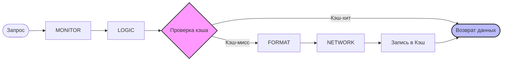

# @hyperttp/cache

Высокопроизводительный плагин кэширования для HTTP-клиента **Hyperttp**,
работающий на базе `lru-cache`.
Перехватывает идемпотентные запросы на фазе управления (`CONTROL`),
сводя к нулю нагрузку на сеть при повторных вызовах.

## Особенности

- ⚡ **Нулевая задержка**: Проверяет кэш на фазе `CONTROL`,
полностью минуя сетевой стек.
- 📦 **LRU Стратегия**:
Автоматически вытесняет старые данные при достижении лимитов (благодаря `lru-cache`).
- 📊 **Прозрачная статистика**: Интегрируется в системный вызов `client.getStats()`,
добавляя метрику `cacheSize`.
- 🧹 **Ручное управление**:
Добавляет метод `client.clearCache()` для принудительного сброса данных.
- 🔒 **Строгая типизация**:
Полная поддержка TypeScript «из коробки» через Module Augmentation.

## Установка

```bash
# Использованием bun (рекомендуется)
bun add @hyperttp/cache

# Или через npm/pnpm
npm install @hyperttp/cache

```

## Использование

Плагин автоматически обнаруживается менеджером плагинов `Hyperttp`
(если настроен автоскан `package.json`), либо его можно передать явно.

### Настройка при инициализации клиента

```typescript
import { HyperClient } from "@hyperttp/core";
// Импорт нужен для того, чтобы TypeScript подтянул расширение типов для HttpClientOptions
import "@hyperttp/cache"; 

const client = new HyperClient({
  verbose: true,
  cache: {
    enabled: true,
    max: 500,              // Максимальное количество объектов в кэше
    ttl: 1000 * 60 * 5,    // Время жизни кэша (5 минут)
  }
});

// Первый запрос пойдет в сеть
const data1 = await client.get("https://api.example.com/data");

// Второй запрос вернется мгновенно из кэша
const data2 = await client.get("https://api.example.com/data");

```

### Метрики и управление кэшем

Плагин динамически расширяет инстанс ядра, добавляя методы управления:

```typescript
// Получить текущий размер кэша вместе с общими метриками ядра
console.log(client.getStats()); 
// Выведет: { requests: 2, ..., cacheSize: 1 }

// Полная очистка кэша вручную
(client as any).clearCache(); 

```

## Как это работает (Архитектура)

Плагин встраивается в «луковичную» (onion) архитектуру запроса на фазе **`CONTROL`**:



Он перехватывает исключительно `GET` запросы (проверка через флаг `req.isGet`).
Если URL уже есть в памяти, выполнение сетевой цепочки прерывается,
и клиент моментально возвращает сохраненный результат.

## Лицензия

MIT © dirold2
